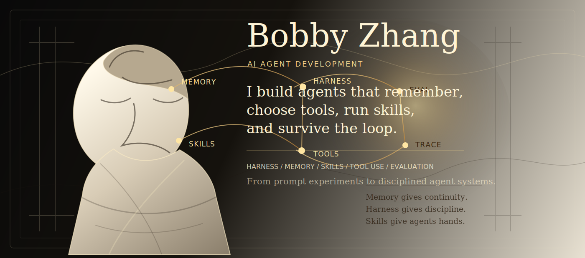

  

  <samp>
    AI AGENT DEVELOPMENT / HARNESS / MEMORY / SKILLS / TOOL USE / EVALUATION
  </samp>

  <a href="https://github.com/langgenius/dify">Dify</a> ·
  <a href="https://github.com/langgenius/dify-official-plugins">Agent Tools</a> ·
  <a href="https://github.com/Gmasterzhangxinyang/jarvis-amber-protocol-hud">Agent Interface</a> ·
  <a href="https://github.com/Gmasterzhangxinyang/RetinexMemory-for-Low-light-enhancement">Memory Research</a>

---

I am obsessed with the moment an AI agent stops feeling like a prompt and starts feeling like a living system:
it remembers, chooses tools, calls skills, checks itself, and keeps moving.

My work orbits that moment. I build agent harnesses, memory patterns, plugin workflows, developer demos,
and interfaces that make invisible reasoning feel structured, inspectable, and alive.

## Agent Religion

| Layer | What I want from it |
| --- | --- |
| **Harness** | A disciplined loop for planning, acting, observing, recovering, and evaluating. |
| **Memory** | Continuity across time: useful recall, state, preference, and context that does not rot. |
| **Skills** | Capabilities that turn an agent from a talker into a maker. |
| **Tools** | External actions with clear contracts, traces, and failure paths. |
| **Interface** | A cockpit for agent state: not decoration, but perception. |

## Current Coordinates

- Building around the **Dify** ecosystem: plugins, workflows, docs, community, and agent product patterns.
- Exploring **agent harness design**: tool loops, skill routing, memory surfaces, eval hooks, recovery behavior.
- Designing demos where AI feels less like autocomplete and more like an operating layer.

## Selected Work

| Work | Signal |
| --- | --- |
| [dify-official-plugins](https://github.com/langgenius/dify-official-plugins) | Tools and integration surfaces for agentic applications. |
| [dify-docs](https://github.com/langgenius/dify-docs) | Developer-facing knowledge for building with Dify. |
| [jarvis-amber-protocol-hud](https://github.com/Gmasterzhangxinyang/jarvis-amber-protocol-hud) | A cinematic interface study for agent state, presence, and feedback. |
| [RetinexMemory-for-Low-light-enhancement](https://github.com/Gmasterzhangxinyang/RetinexMemory-for-Low-light-enhancement) | Memory-shaped research implementation for visual enhancement. |

## Stack Of Interest

  <code>Agent Harness</code>
  <code>Memory</code>
  <code>Skills</code>
  <code>Tool Calling</code>
  <code>RAG</code>
  <code>Evaluation</code>
  <code>Dify</code>
  <code>Python</code>
  <code>TypeScript</code>
  <code>PyTorch</code>

> Memory gives agents continuity. Harness gives them discipline. Skills give them hands.

